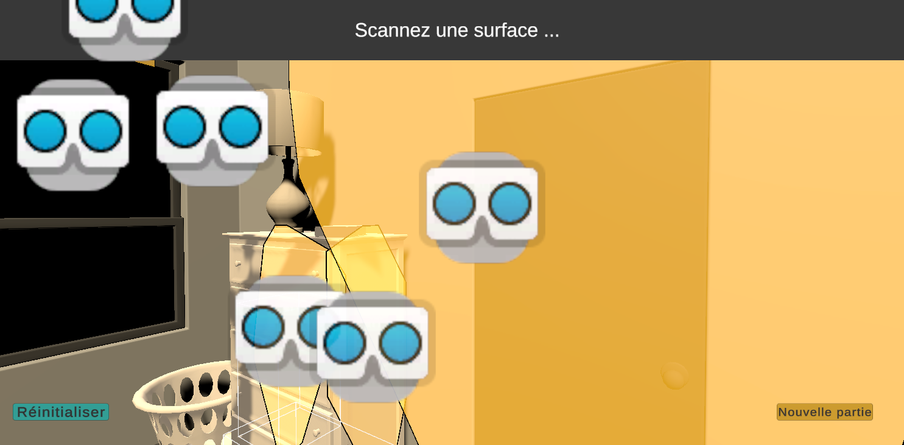
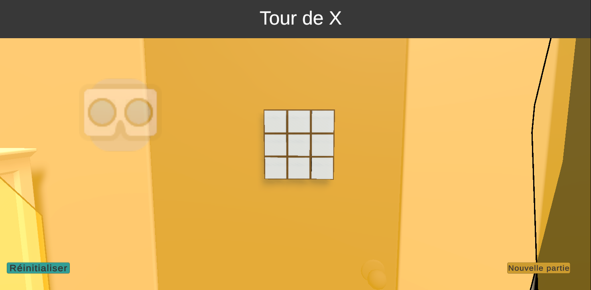
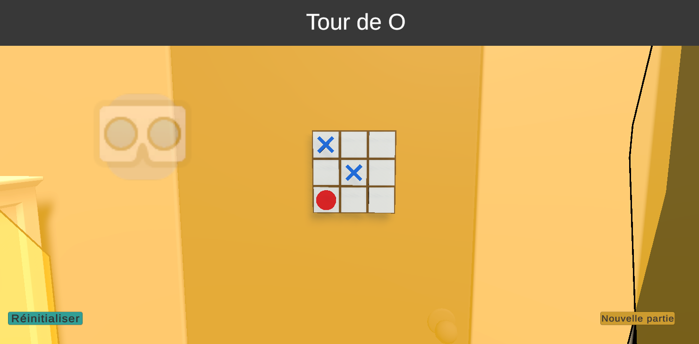
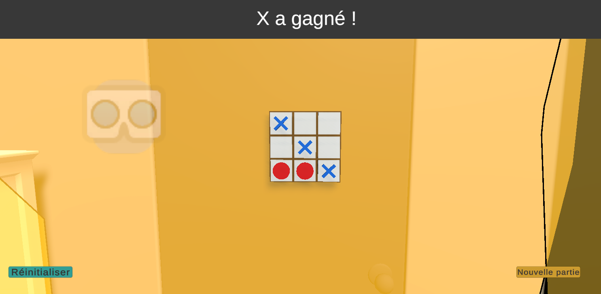
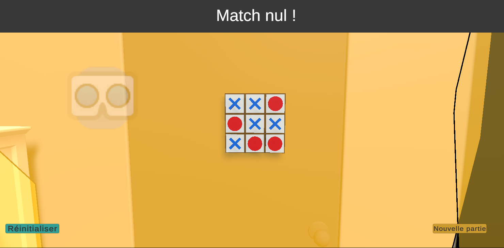

# TicTacToeVR

**Auteur :** Frédérick Bethermat
**Date :** 2026-02-07

---

## Description brève

TicTacToeVR est une application en réalité augmentée qui permet à l’utilisateur de placer une grille de Tic-Tac-Toe dans son environnement réel.
Deux joueurs s’y affrontent ensuite à tour de rôle en posant des symboles X et O. La partie se termine lorsqu’un joueur aligne trois symboles, ou par un match nul si aucune combinaison gagnante n’est obtenue.

---

## Versions Unity et packages utilisés

**Version Unity :** 6.3 LTS (6000.0.5f1)

### Packages (Package Manager)

- **AR Foundation**
- **ARCore XR Plugin**
- **ARKit XR Plugin**
- **TextMeshPro**

---

## Captures d'écrans

### Scan de surface

### Plateau placé

### Tour de jeu (X / O)

### Fin de partie (victoire)

### Fin de partie (égalité)

---

## Défis rencontrés et solutions

L'animations pour un placement de symbole ne fonctionne pas, je n'ai pas réussi a régler le problème.
L'animation de victoire ne fonctionne pas, je n'ai pas réussi a régler le problème.
ARanchor n'est pas mis en place, car je n'ai pas trouvé de documentation avec des exemples de code.
J'avais du mal à savoir comment bâtir ma logique de jeu et mon GameManager. La solution que j'ai opté est de demander à l'IA de savoir comment je devrais m'y prendre.

## Requêtes à l'intelligence artificielle

Les questions posées à l'IA lors du développement du projet :

1. Sans me donner de code, comment je devrais m'y prendre pour bâtir ma logique de jeu ?
2. Comment je peux faire pour que je ne puisse pas jouer sur la même case ?
3. Sans me donner de code, comment je devrais m'y prendre pour faire mon GameManager pour gérer les intéractions de victoire ?
4. Comment je pourrais faire pour vérifier chaque combinaison de victoire ?
5. Mes animations ne fonctionne pas, peut tu me dire qu'est ce que je dois vérifier ?
